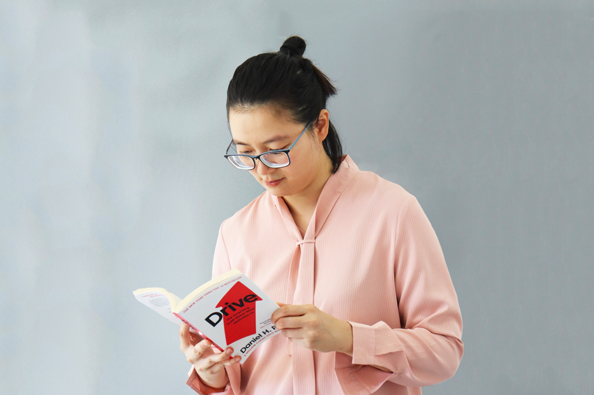
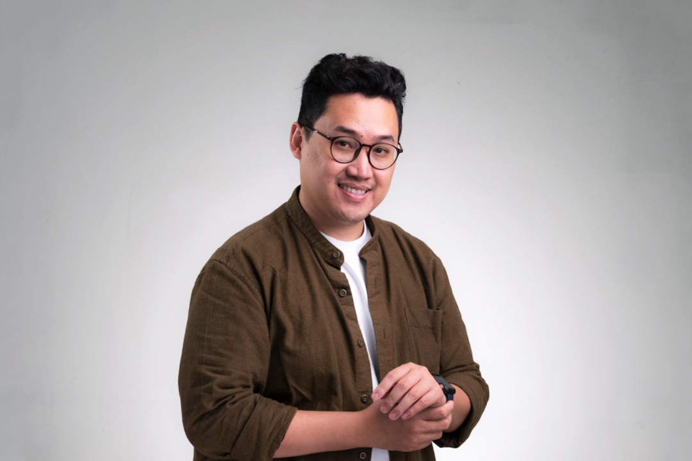
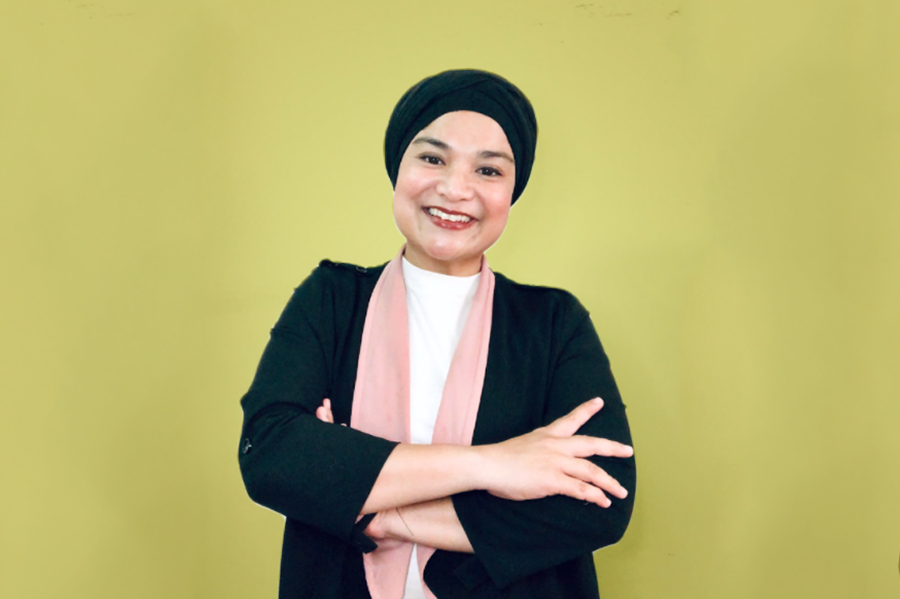

## About Us

How do you modernize education? That’s the question that drives Mavensdotlive.
For us, students of the future should have greater agency to choose and access their education.

We welcome that future with our marketplace where anyone can join and choose what they want to learn.
And unlike traditional education, our marketplace is able to constantly adapt and update itself
to a fast changing world.

Is that future still far away? For some, maybe – but we like to think we’re there early

## Our Vision

To help Individuals realize their potential through modernized education.

## Our Mission

To provide flexible and accessible education for all

## Our Values

We believe that everyone should strive to learn and evolve, no matter at what age.

## Meet Our Leadership Team

<x-team>

  <figure>
    
    <figcaption>
      <h3 as="name">Goh Chai Li</h3>
      Chief Learning Officer
    </figcaption>
  </figure>

  <figure>
    
    <figcaption>
      <h3 as="name">Nazrin Asyraf</h3>
      Corporate Communication Associate
    </figcaption>
  </figure>

  <figure>
    
    <figcaption>
      <h3 as="name">Phatsalin Fon</h3>
      Chief Creative Officer
    </figcaption>
  </figure>

</x-team>

## Founder's Story

After completing her degree in secondary education, Goh Chai Li (CL) was meant to teach Mathematics or
Accounting. Things changed when she returned from the UK and joined a business plan competition
– setting off a newfound interest in entrepreneurship. This interest sparked a career clarity and was
followed by a Masters in Entrepreneurship, an 8 months general management trainee role at RBA and
eventually joining Politeknik Brunei in 2013 as a lecturer specializing in entrepreneurship education.

It was at Politeknik Brunei that CL developed her idea for continuity and specialization in education.
She believes that everyone has a path and your education should support and focus on that path. From there,
the concept of giving students a say in what they want to learn, the mix and matching of subjects, and
the personalization of education, started to take shape. These ideas helped form Mavensdotlive –
but you can’t tell the story of Mavensdotlive without Mavens’ Hive!

In January 2019, CL started Mavens’ Hive; an award winning co-working space which also hosts workshops
and talks. Then in 2020, due to the pandemic, the public now sees online learning as an equally viable
form of education. This shift prompted CL to create an online learning platform herself, which also
gave home to her earlier ideas of flexibility and accessibility. Mavensdotlive was finally introduced
to the public in November 2020 and CL currently runs the Mavens brand full time.

## Offer for Students

Immediately applicable skills and knowledge for their life and career. Students either learn
offline at Mavens’ Hive where comfort and audio/video resources are provided or learn online via Zoom
where they can connect with Instructors remotely.

## Offer for Businesses

Customized learning programs that are organized and relevant to their workforce. We discuss with
businesses their workforce’s background, preferences and past training records and from there, carefully
plan a learning roadmap to reskill and upskill.

## Contact Us

Have a question? Feel free to reach out to someone from our press team, and we’ll get back to you promptly.

<a as="x-button" x:as="a" size="2" variant="red" href="mailto:hello@mavens.live">HELLO@MAVENS.LIVE</a>
